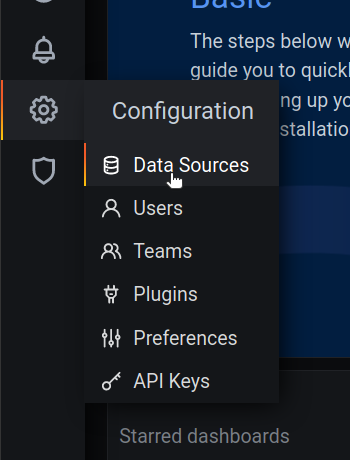
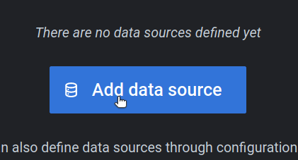
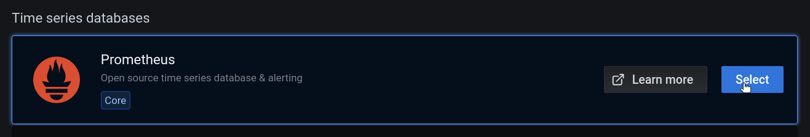
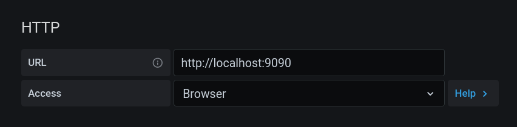
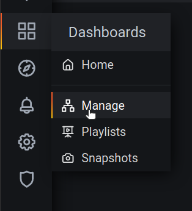
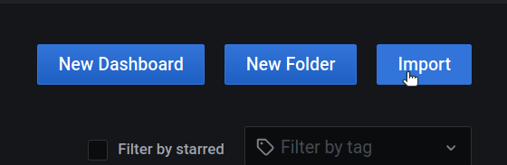
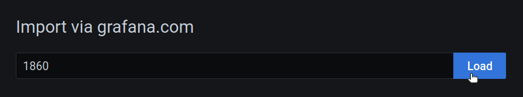
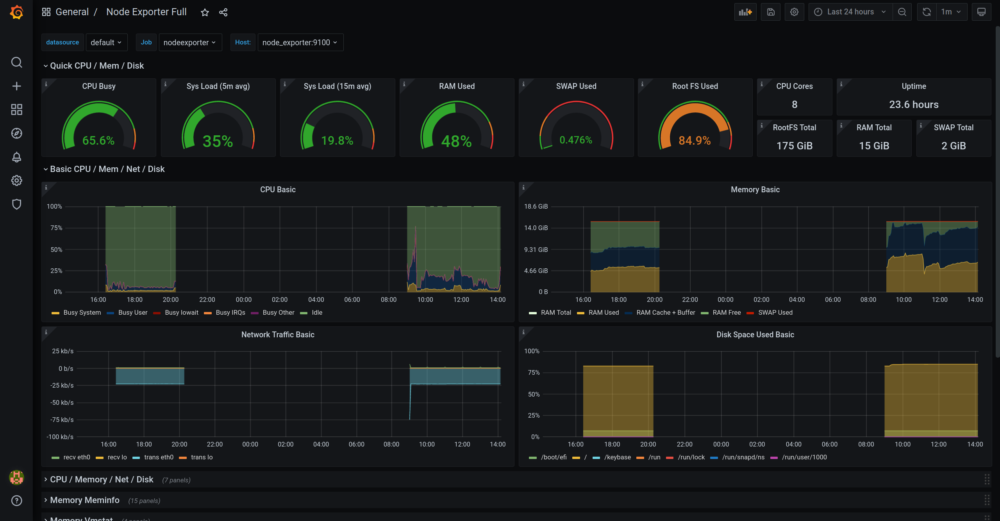

# MonitorinGrafana

A docker-compose example to monitor a local computer with Grafana, Prometheus,
Alertmanager and node-exporter.

## Setup

### Installation
`docker-compose up -d`

### Configuration

##### Data source

Open a browser and connect to http://localhost:3000

On the homepage, select configuration -> Data Source

Add new data source

Choose Prometheus

On the configuration panel, set the access method to "Browser". Just let the defaut url http://localhost:9090

Save and test.

##### Dashboard

Go to Dashboard -> Manage

Click on Import

Type 1860 and Load

Select prometheus as the data source and Import.

So now, you have a fully working monitoring board. Enjoy !
